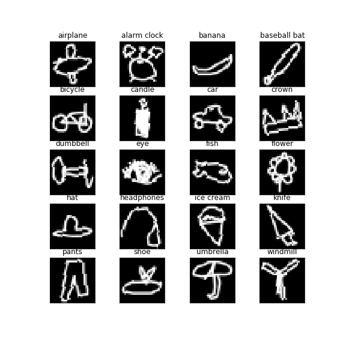
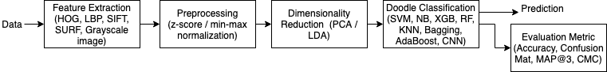
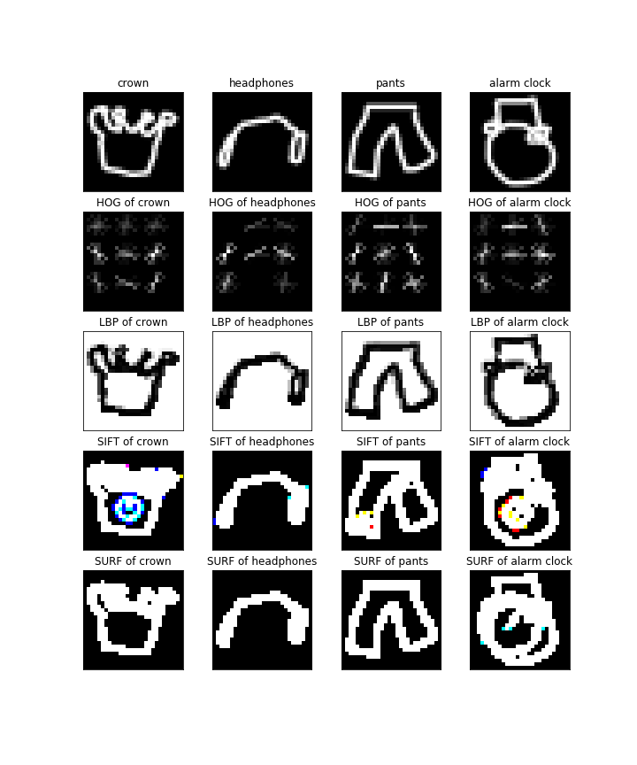
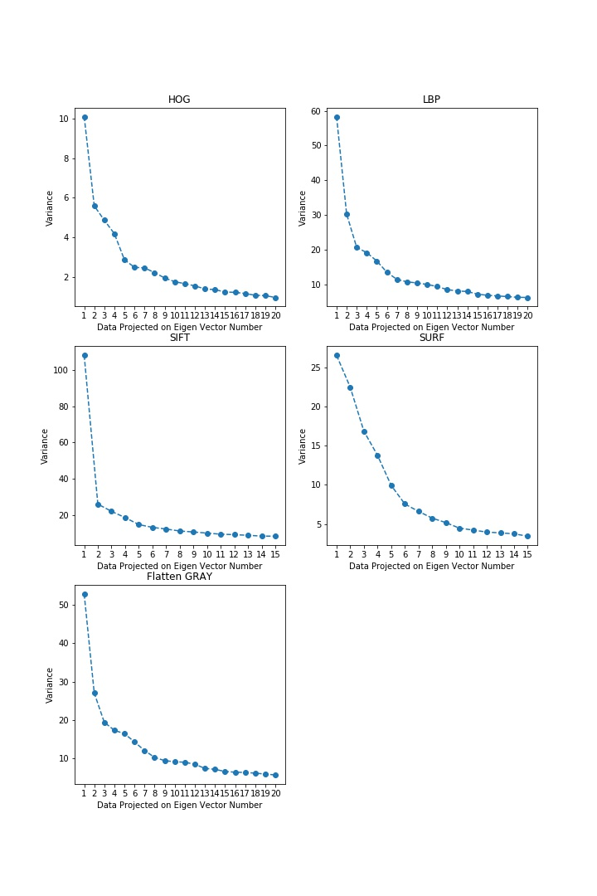
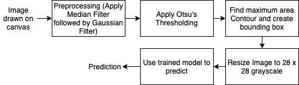
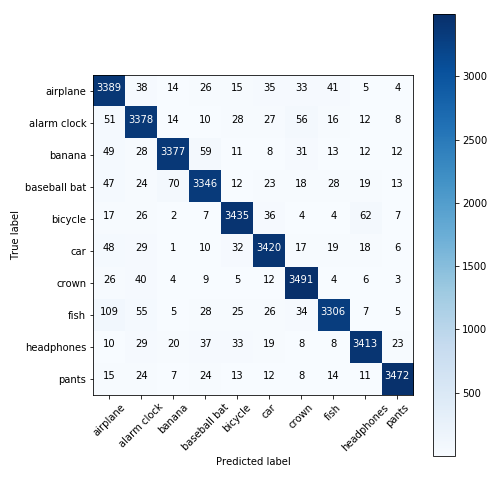
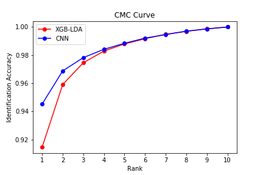
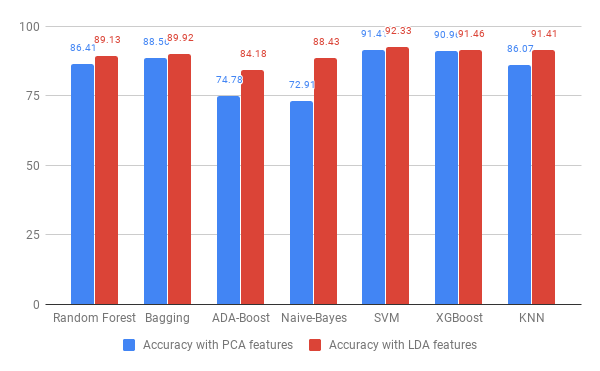
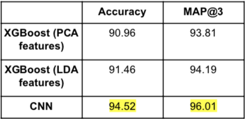

# Quick-Draw

## Project Overview

This project is done as a part of `Computer Vision` Course.

In this project our aim is to identify whether a cell is malaria infected or not. We show an in breadth & depth analysis of various features like **HOG, LBP, SIFT, SURF, pixel values** with feature reduction techniques **PCA, LDA** along with normalization techniques such as **z-score** and **min-max** over different classifiers such as **Naive Bayes, SVM XGBoost, Bagging, AdaBoost, K-Nearest Neighbors, Random Forests** and compare their performance by tuning different hyperparameters. We evaluate the performance of these classifiers on metrics such as **Accuracy, Precision, Recall, F1 score and ROC**.

In Quick Draw the AI system tries to classify the hand-drawn doodle into a predetermined category. By this project we are trying to achieve the same using different feature extraction techniques like **HOG, LBP, SIFT, SURF, pixel values** with feature reduction techniques **PCA, LDA** and applying various classifiers such as **Naive Bayes, Random Forest, SVM, XGBoost, Bagging, ADA-boost, KNN and CNN** to compare their performance on different evaluation metric such as **Accuracy, MAP@3, CMC Curve and Confusion Matrix**.

Project Poster can be found in [CV-Poster-Final.pdf](CV-Poster-Final.pdf).

## Problem Usecase

- It is a challenge in Computer Vision & Machine Learning to handle noisy data and dataset with many different representations of the same class. The Quick Draw Doodle Recognition challenge is a good example of these issues because different users may draw the same object differently or the doodles could be incomplete which is similar to noisy data.
- This application can be used as a fast prototyping tool for designers or artists by suggesting them the accurate templates on the basis of the rough doodles made by them.
- It can be extended by replacing the doodles with doodles of alphabets and then convert the hand-written text into digital text format.

## Dataset

- The Quick Draw dataset is a collection of millions of doodle drawings of 300+ categories. The drawings draw by the players were captured as 28 x 28 grayscale images in .npy format with respect to each category.
- The complete dataset is huge (~73GB) and so we have used only a subset of the complete data (20 categories).
- The dataset is split in training and test set with 80-20 ratio, the training set is further split into train and validation with 70-30 ratio.
- Fig above shows a doodle image of each class in our sampled dataset.
- Dataset can be downloaded from [here](https://console.cloud.google.com/storage/browser/quickdraw_dataset/full/numpy_bitmap/).

## Proposed Algorithm 

- CNN Model Architecture

- We have followed a conventional computer vision pipeline to train our model. Fig. below shows the training pipeline followed.
  
  

- Feature Extraction: Extract texture information from HOG & LBP, Spatial information from SIFT & SURF and pixel information from grayscale image.
  
  

- Preprocessing: Feature normalization by Min-Max and Z-score to bring features on a similar scale.
- Dimensionality Reduction: PCA or LDA was applied to project the features with max separation. In PCA number of components were selected by plotting the variance over projected data.
  
  

- Classification: Different classifiers were trained and tested with different parameters and feature combinations.
- Prediction and Evaluation Metrics: Metrics such as accuracy, MAP@3, CMC curve was found to compare the performance of classifiers.
- For Production time the following pipeline was used where contours were used to find the object.
  
  

## Evaluation Metrics and Results

Follwing are the results of the project:

- Confusion Matrices were plotted for best performing classifiers.
  

    
    
  

- Mean Average Precision (MAP@3) score were found for classifiers to find performance in top 3 predictions.
- CMC Curve was plotted to find the identification accuracy at different ranks. 
  
  

- Accuracy of different classifiers was used to compare the performance using PCA and LDA.
  
  

  

## Interpretation of Results

- In Dimensionality reduction technique LDA performs better than PCA as it is able to separate data on the basis of classes.
- Texture based features gave good classification accuracy as compared to other features.
- XGBoost shows best performance as compared to all the other non-deep learning models as the dataset includes images of multiple classes over which XGboost is able to learn better because of boosting technique.
- CNN gives the best performance with a MAP@3 of 96.01%. This is because the kernels are able to learn different feature representations which help the model to differentiate between the classes well.

## References

1. Lu, W., & Tran, E. (2017). Free-hand Sketch Recognition Classification.
2. M. Eitz, J. Hays, and M. Alexa. How do humans sketch objects? ACM Trans. Graph. (Proc. SIGGRAPH), 31(4):44:1– 44:10, 2012.
3. K. He, X. Zhang, S. Ren, and J. Sun. Deep residual learning for image recognition. IEEE Conference on Computer Vision and Pattern Recognition, 2016.
4. Kim, J., Kim, B. S., & Savarese, S. (2012). Comparing image classification methods: K-nearest-neighbor and support-vector machines. Ann Arbor, 1001, 48109-2122.
5. Ha, D., & Eck, D. (2017). A neural representation of sketch drawings. arXiv preprint arXiv:1704.03477.
   
## Project Team Members

1. Anubhav Shrimal
2. Vrutti Patel